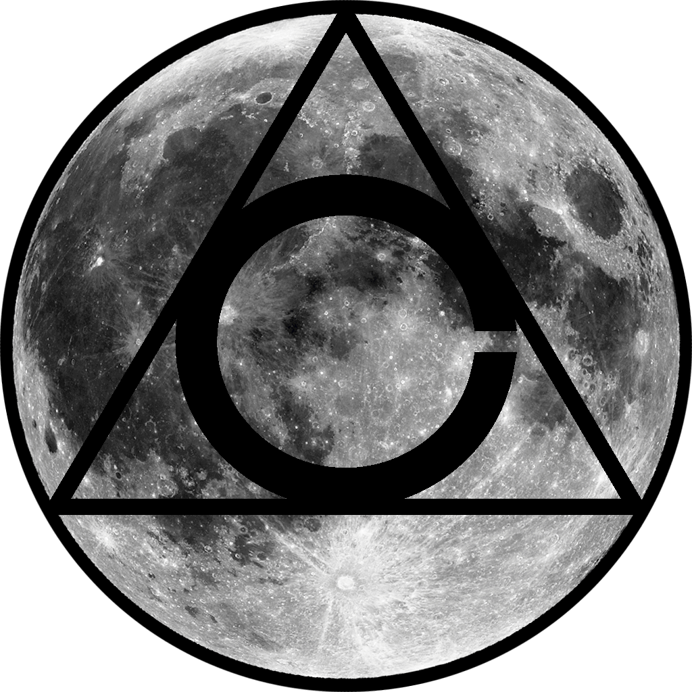

<!-- HEADING -->

<p align="center">
  
</p>
<h1 align="center">️not another demo</h1>

<!-- DESCRIPTION -->

<h3 align="center">
  <span role="img" aria-label="Flower Playing Cards">🎴</span>
</h3>
<p align="center">
  <strong>not another demo</strong><br>
  Created with <a href="https://unity3d.com/" target="_blank">Unity</a> to showcase AI behaviors and networking capabilities.
</p>

<!-- INFORMATION (Shields:IO) -->

<p align="center">
    <!-- HEY DON'T FORGET TO FIX THE URLS -->
    <a href="https://github.com/acfromspace/notanotherdemo/blob/master/LICENSE">
        </a>
    <a href="https://twitter.com/intent/follow?screen_name=acfromspace">
        </a>
</p>

<!-- FEATURES -->


[*not another demo*](https://github.com/acfromspace/notanotherdemo) is a application with the following features:

- **Premise.** Create a game application that showcases artificial intelligence manuevers such as "Lazy Flight" and "Circle a Tree" behaviors. Also showcase networking capabilities so two players can coexist in the same environment from different computers.
- **Design.** A simple main menu that showcases each of the designs.
- **Future endeavors.** Showcasing more of the same, perhaps a game that learns the player's movements as the player goes through more designs to better enhance the machine learning.

<!-- QUICK INSTALLATION -->

## <span role="img" aria-label="Sparkles">✨</span> Quick Installation

- Clone the repo `git clone https://github.com/acfromspace/notanotherdemo`
- Change directory `cd notanotherdemo`
- Change directory `cd Game Executable`
- Activate the `.exe`

<!-- IN-DEPTH GUIDE -->

## <span role="img" aria-label="Video Game">🎮</span> Controls

```txt
Use mouse to navigate the menu.
```

<!-- WHAT'S INSIDE? -->

## <span role="img" aria-label="Thinking Face">🤔</span> What's inside?

A quick look at the top-level files and directories you'll see in this project.

```
  .
1 ├── Development Area/
2 ├── Game Documentation/
3 ├── Game Executable/
4 ├── .gitignore
5 ├── avatar.png
6 ├── LICENSE   
7 └── README.md
```

1.  **`Development Area/`**: Unity project files.
2.  **`Game Documentation/`**: Analysis of Networking Platform and Game Design Document (GDD).
3.  **`Game Executable/`**: The droids you're looking for are here.
4.  **`.gitignore`**: This file tells `.git` which files it should not track nor maintain a version history for. For instance, you shouldn't let anyone get your `.env` files. (These usually contain your API keys)
5.  **`avatar.png`**: Image used in the README.md.
6.  **`LICENSE`**: An open source license that protects contributors and users depending on the license chosen.
7.  **`README.md`**: A markdown file containing useful reference information about your project. The file you're reading right now!

<!-- LICENSE -->

## <span role="img" aria-label="Oncoming Police Car">🚔</span> [License](LICENSE)

The code in this project is under a specific open source license.
